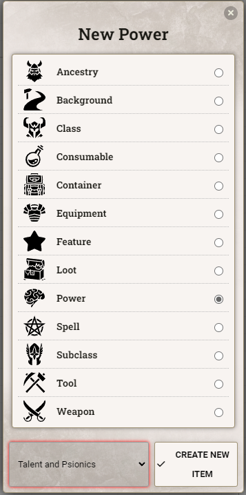

# Talent Psionics

This module adds character sheet support for The Talent class from [MCDM's The Talent and Psionics](https://mcdm.gg/Talent) supplement.

Supported character sheets:

- New 5e Character Sheet
- Legacy 5e character sheet
- NPC Sheet
    <!-- * [Tidy5e Sheet](https://foundryvtt.com/packages/tidy5e-sheet/) -->
  (Tidy TBD when it updates to 3.0)

Other character sheets are untested and may or may not have formatting issues.

## Psionic Powers as a New Item Type

This module allows you to to create powers as a brand new item type, "Power". Powers display in the Spellbook tab just like spells with unique icons for the eligible specialties. Manifesting at higher Orders is automatically managed based on your Talent level.

## Strain Tracker

This module also adds a new tab to the character sheet of your Talent for tracking your strain. Your maximum strain is automatically calculated based on your Talent level, and your options for how you would like to apply strain are automatically greyed out based on how much potential strain you have left. Strain can be applied by either ticking the checkbox next to the desired effect, or by adjusting the numbers in the input boxes at the top of each track. Total strain is automatically calculated.

### Based on the CeaneC Talent Sheet

Huge credit to the original [Talent Sheet by CeaneC](https://foundryvtt.com/packages/ceane-talent/), which this module uses as a base for the Strain Tracker.

<!--  -->

## FAQ

### **Q:** How do I add the Strain tab to a sheet?

**A:** Add a class to your character with a class identifier of `talent`.

### **Q:** How do I add powers to my spellbook?

**A:** Create the power in the item directory and drag to your sheet. Once you have a power on your sheet you can always duplicate it to create more.

### **Q:** How can I reference Strain in macros/modules?

**A:** The module's fields are stored in the following flags:

- `flags.talent-psionics.strain.total`
- `flags.talent-psionics.strain.max`
- `flags.talent-psionics.strain.body`
- `flags.talent-psionics.strain.mind`
- `flags.talent-psionics.strain.soul`

### **Q:** How can I add a resource bar above the token showing their total strain?

**A:** Since these attributes are currently restricted to system-level resources, you'll have to override one of the existing attributes using Active Effects.

Choose whether you would like to override Resource 1 (primary), Resource 2 (secondary), or Resource 3 (tertiary) on the character sheet. Then create a new Passive Effect on the character with the following settings:

<!--  -->

- Total:
  - Atribute Key: `system.resources.primary.value`
  - Change Mode: `Override`
  - Effect Value: `@flags.talent-psionics.strain.total`
- Max:
  - Attribute Key: `system.resources.primary.max`
  - Change Mode: `Override`
  - Effect Value: `@flags.talent-psionics.strain.max`

### **Q**: How can I change the rate that a character's Max Strain goes up?

**A:** Create an active effect that overrides the `@flags.talent-psionics.strain.max` flag, and put in the desired formula in Effect Value. For more control, you can edit the class's advancement to add a Scale Value that increases as they level up, and reference the value in the Active Effect.

<!--  -->
